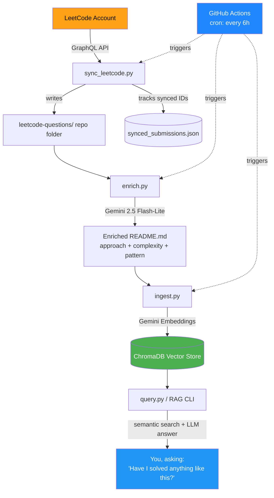
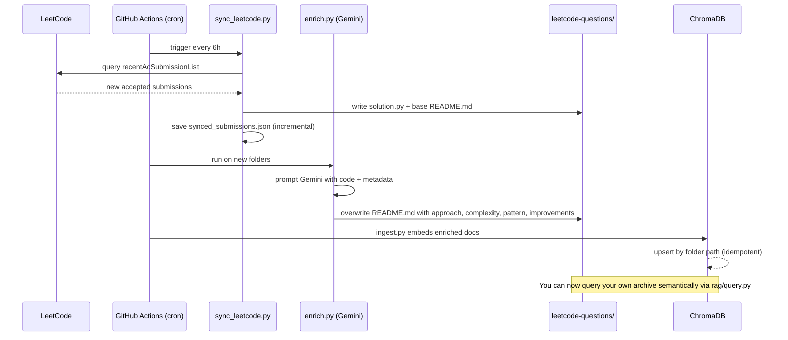
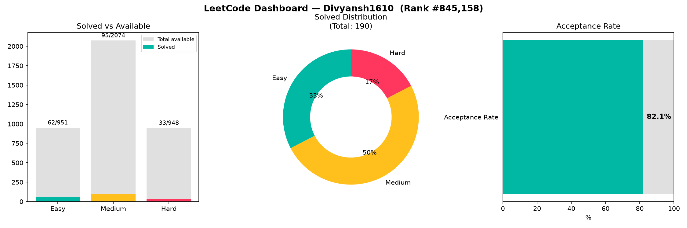

# 🧠 LeetCode AI Sync

> Automatically syncs accepted LeetCode submissions to GitHub, enriches each one
> with AI-generated explanations and complexity analysis, and exposes the whole
> archive as a queryable RAG knowledge base.


[](https://github.com/DIVYANSH1610/leetcode-ai-sync/actions/workflows/sync.yml)

---

## Why this exists

Solving LeetCode problems is only half the value — the other half is remembering
*how* you solved them, *why* that approach worked, and being able to recognize
the same pattern next time it shows up. This project closes that loop:

1. Every accepted submission is automatically pulled into a structured GitHub repo
2. Each solution is enriched by an LLM with an explanation, complexity analysis,
   and pattern tag — turning a bare code file into a study artifact
3. The whole archive becomes searchable via RAG, so you can ask
   *"have I solved anything like this before?"* and actually get an answer

---

## Architecture



---

## Pipeline stages



---

## Project structure

```
leetcode-ai-sync/
├── .github/workflows/sync.yml      # runs the full pipeline every 6 hours
├── scripts/
│   ├── sync_leetcode.py             # Phase 1 — LeetCode → repo
│   ├── enrich.py                    # Phase 2 — AI enrichment
│   └── stats.py                     # pattern/difficulty breakdown + chart data
├── rag/
│   ├── ingest.py                    # Phase 3 — embed into ChromaDB
│   └── query.py                     # Phase 3 — RAG chat over your archive
├── leetcode-questions/               # auto-generated, organized by tag
│   └── Linked_List/
│       └── 2095-delete-the-middle-node-of-a-linked-list/
│           ├── solution.py
│           └── README.md             # AI-enriched
├── data/
│   ├── synced_submissions.json       # dedup tracking (saved incrementally)
│   ├── stats.json                    # generated by stats.py
│   └── chroma_store/                  # local vector DB
├── requirements.txt
├── setup_project.py                  # one-shot scaffolder for this whole repo
└── .env.example
```

---

## Tech stack & why each piece was chosen

| Layer | Tool | Why |
|---|---|---|
| Data source | LeetCode GraphQL (internal API) | No official public API exists; this is the same endpoint the LeetCode frontend itself uses |
| Automation | GitHub Actions (cron) | Zero hosting cost, runs natively where the repo lives |
| LLM enrichment | Gemini 2.5 Flash-Lite | Fast, generous free-tier daily quota, good enough quality for structured explanation generation |
| Vector store | ChromaDB | Lightweight, file-based, no external service needed for a personal-scale archive |
| Embeddings | `gemini-embedding-001` | Same provider as generation, avoids juggling two API keys |
| RAG interface | Rich-based CLI | Fast to build, focuses effort on the retrieval logic rather than UI chrome |

---

## How it works, end to end

### 1. Sync — `scripts/sync_leetcode.py`
Polls `recentAcSubmissionList` via LeetCode's GraphQL endpoint using your session
cookies, fetches the actual code for each new accepted submission via
`submissionDetails`, and fetches problem metadata (difficulty, tags, title) via
the `question` query. Writes everything into
`leetcode-questions/<primary-tag>/<id>-<slug>/`. Tracks synced submission IDs in
`data/synced_submissions.json`, saved **incrementally after each submission** —
so an interrupted run never loses progress or causes duplicate API calls.

### 2. Enrich — `scripts/enrich.py`
For each new solution folder, sends the code + metadata to Gemini with a
structured prompt and parses back four fixed sections: **Approach**,
**Complexity**, **Pattern**, and **Could it be improved?**. This turns a bare
solution file into something genuinely reviewable — the same way a senior
engineer would annotate a PR.

### 3. Ingest — `rag/ingest.py`
Walks the enriched repo and embeds each problem's full README + code into a
local ChromaDB collection, keyed by folder path so re-running is idempotent
(`upsert`, not `insert`).

### 4. Query — `rag/query.py`
A RAG loop: embed the question → retrieve top-k similar problems → pass them
as context to Gemini → get a grounded answer referencing your actual past
solutions, not a generic LeetCode explanation.

---

## Setup

```bash
# 1. Clone and enter the project
cd leetcode-ai-sync

# 2. Create a virtual environment (Python 3.11 recommended)
uv venv --python 3.11
.\venv\Scripts\Activate        # Windows
# source venv/bin/activate     # macOS/Linux

# 3. Install dependencies
uv pip install -r requirements.txt

# 4. Configure credentials
cp .env.example .env
# Fill in LEETCODE_SESSION, LEETCODE_CSRF, LEETCODE_USERNAME, GEMINI_API_KEY
```

**Getting LeetCode cookies:** DevTools → Application/Storage → Cookies →
`leetcode.com` → copy `LEETCODE_SESSION` and `csrftoken`. These expire
periodically and need refreshing.

**Getting a Gemini key:** https://aistudio.google.com/apikey

### Run the pipeline manually

```bash
python scripts/sync_leetcode.py
python scripts/enrich.py leetcode-questions/<folder-printed-above>
python rag/ingest.py
python rag/query.py
python scripts/stats.py
```

### Automate it

Add `LEETCODE_SESSION`, `LEETCODE_CSRF`, `LEETCODE_USERNAME`, `GEMINI_API_KEY`
as repo secrets (Settings → Secrets and variables → Actions). The workflow in
`.github/workflows/sync.yml` then runs the full pipeline every 6 hours and
commits the results automatically.

---

## Example output

**Auto-generated README for a synced solution:**

```markdown
# 54. Spiral Matrix
**Difficulty:** Medium
**Tags:** Array, Matrix, Simulation

## Approach
The solution simulates the spiral traversal by maintaining four pointers —
top, bottom, left, right — that define the current boundaries of the
unvisited portion of the matrix...

## Complexity
- Time: O(m * n)
- Space: O(m * n)

## Pattern
Simulation

## Could it be improved?
The current approach is optimal in both time and space — no fundamentally
more efficient algorithm exists for this problem.
```

**RAG query in action:**

```
> Have I solved anything involving linked lists?

Yes, you have solved two problems involving linked lists:
 • 2095. Delete the Middle Node of a Linked List
 • 2130. Maximum Twin Sum of a Linked List
```

---

## My LeetCode profile, pulled live

Run `python scripts/profile_stats.py` any time to refresh this — it pulls your
real account totals straight from LeetCode and regenerates the dashboard below.

| Metric | Value |
|---|---|
| Total solved | **190** |
| Acceptance rate | **82.1%** |
| Global ranking | **#845,158** |
| Badges earned | 5 (incl. 100 Days Badge 2025) |

| Difficulty | Solved | Available | % cleared |
|---|---|---|---|
| Easy | 62 | 951 | 6.5% |
| Medium | 95 | 2,074 | 4.6% |
| Hard | 33 | 948 | 3.5% |



> This is pulled directly via LeetCode's GraphQL API, the same one used for
> the sync pipeline above — so the same auth cookies power both features.

---

## Repo-local solve stats

This is a separate, narrower view — only the problems that have actually been
synced into *this* repo via the pipeline (run `python scripts/stats.py` to
refresh):

```
Total problems solved & synced: 20
By Difficulty:   Medium 9 · Hard 7 · Easy 4
By Tag:          Array 8 · Misc 4 · Linked_List 2 · Math 2 · String 2 · DP 1 · Hash_Table 1
```

The gap between this and the full profile above is expected — this repo only
captures what's been solved *since the pipeline started running*. Every future
submission grows this number automatically.


- [x] Phase 1 — automated sync from LeetCode to GitHub
- [x] Phase 2 — LLM enrichment (approach, complexity, pattern, improvements)
- [x] Phase 3 — RAG query over the solved-problems archive
- [x] GitHub Actions automation (runs every 6 hours, zero manual upkeep)
- [ ] Phase 4 — multi-agent enrichment pipeline (categorizer → explainer →
      reviewer → indexer agents via LangChain, instead of a single prompt)
- [ ] Web chat UI (React/Vite) replacing the CLI for the RAG step
- [ ] Weekly auto-generated "patterns I'm weak on" summary from vector store
      clustering
- [ ] Real-time sync via a Chrome extension instead of polling

---

## Notes & limitations

- LeetCode has no official public API; this relies on the same internal
  GraphQL endpoint the website itself uses, authenticated via session cookies.
  These cookies expire periodically and must be refreshed manually.
- Gemini's free tier enforces a daily request quota; enriching large batches
  in one sitting may require spacing requests out or switching to
  `gemini-2.5-flash-lite`, which has a more generous daily limit.
- This project is intended for personal use against your own LeetCode account
  — it is not designed or licensed for scraping other users' submissions.

---

## License

MIT — use freely, attribution appreciated.
